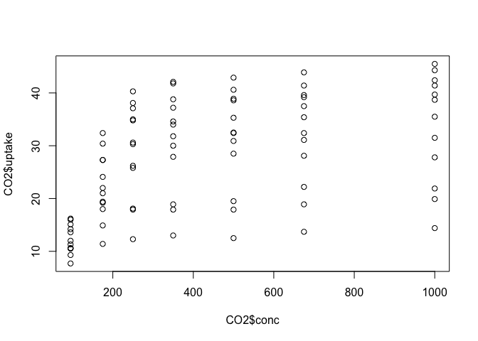

Nous avons fait une belle balade cette après midi à St Paul de Loubressac.


```r
library(tidyverse)
```

```
## ── Attaching packages ──────────────────────────────────────────────────────────────────────────────────────── tidyverse 1.2.1 ──
```

```
## ✔ ggplot2 3.1.0     ✔ purrr   0.3.0
## ✔ tibble  2.0.1     ✔ dplyr   0.7.8
## ✔ tidyr   0.8.2     ✔ stringr 1.3.1
## ✔ readr   1.3.1     ✔ forcats 0.3.0
```

```
## ── Conflicts ─────────────────────────────────────────────────────────────────────────────────────────── tidyverse_conflicts() ──
## ✖ dplyr::filter() masks stats::filter()
## ✖ dplyr::lag()    masks stats::lag()
```

```r
data("CO2")

summary(CO2)
```

```
##      Plant             Type         Treatment       conc     
##  Qn1    : 7   Quebec     :42   nonchilled:42   Min.   :  95  
##  Qn2    : 7   Mississippi:42   chilled   :42   1st Qu.: 175  
##  Qn3    : 7                                    Median : 350  
##  Qc1    : 7                                    Mean   : 435  
##  Qc3    : 7                                    3rd Qu.: 675  
##  Qc2    : 7                                    Max.   :1000  
##  (Other):42                                                  
##      uptake     
##  Min.   : 7.70  
##  1st Qu.:17.90  
##  Median :28.30  
##  Mean   :27.21  
##  3rd Qu.:37.12  
##  Max.   :45.50  
## 
```

```r
plot(CO2$conc, CO2$uptake)
```

<!-- -->

